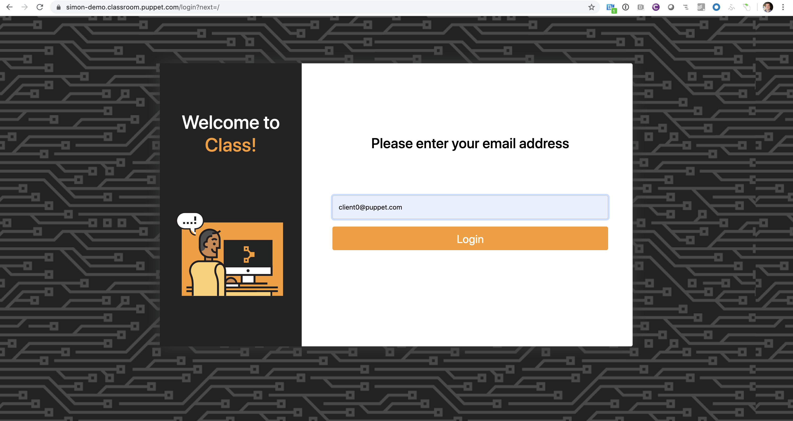

# Demo'ing CD4PE with Hydra

From this point on I will be call my demo environment 'myDemo', so you will need to replace this with the name of you demo environment, including all URLs.

## Spinning up environment from Slack

In the room #team-se-demos, run the command:
`!create <demo_name> with <machine_count> machines for <lifetime> days`

**demo_name:** the name of your demo environment, this will also be the URL base: DemoName-demo.classroom.puppet.com
**machine_count:** the number of machines in your environment (excluding master, CD4PE, Gitlab). 1 Windows machine and 1 Linux machine will be made for each count.
**lifetime:** how long the machines stay up for. This should be a reasonable number so as not to incur costs.

This will give you a link to the github CI, so you can see the progress of your demo environment.

Once it has been spun up, you should get the login page, but going to: `https://myDemo-demo.classroom.puppet.com`  (NOTE: it must be HTTPS)

You should get the following screen:

To login, you'll be using the email address `client0@puppet.com`. Usernames will be made for each of the machines up to the `<machine_count>` specified earlier.
i.e. If the machine_count was 3, we'll have the logins: client0@puppet.com, client1@puppet.com, client2@puppet.com

## Setting up CD4PE

1. Make sure environments exist
2. Setup hardware
3. Make feature branch